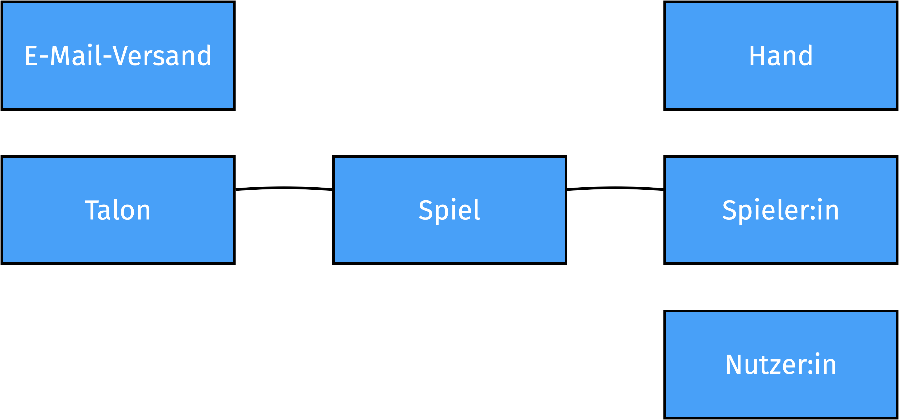
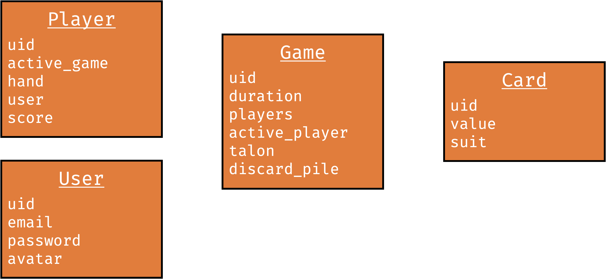
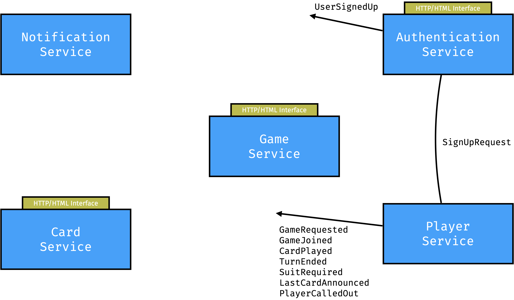

# Konzept zur Implementierung des Kartenspiels Mau-Mau als rundenbasierte Web-Anwendung für 2-5 Spielende

Das vorliegende Konzept soll den Problemraum einer beispielhaften Anwendung im
Module _Frameworks, Daten und Dienste im Web_ beschreiben. Dabei werden die
wesentlichen _Domänen_ beschrieben, _Events_ definiert und der grundsätzliche
Kommunikationsfluss aufgezeigt.

## Problemraum

Es soll das Kartenspiel _Mau-Mau_ als rundenbasierte Web-Anwendung für 2-5
Spielende umgesetzt werden. Der Fokus dabei liegt auf einem verteilten System
mit Event-basierter Kommunikation. Neben den eigentlichen Spielregeln, die im
Anschluss beschrieben sind, soll die Anwendung über ein einfaches
Nutzer:innen-Modell verfügen und den unberechtigten Zugriff verhindern.

Nutzer:innen können an beliebig vielen unterschiedlichen Spielen gleichzeitig
teilnehmen.

### Spielregeln

Mau-Mau ist ein Kartenspiel für zwei bis fünf Spielende, bei dem es darum geht,
ihre Karten möglichst schnell abzulegen. Meist wird Mau-Mau mit einem
französischen oder deutschen Kartenspiel zu 32 (deutsches Skatblatt) Karten
gespielt, ist aber prinzipiell mit jedem anderen Blatt mit bis zu 52 Karten
spielbar.

Mau-Mau ist ein Auslegespiel. Gewonnen hat, wer zuerst alle ihre Karten
abspielen konnte. Der Gewinn wird mit einem Ausruf „Mau Mau“ kundgetan. Zu
Beginn erhalten die Spielenden die gleiche Anzahl Karten (oft fünf oder sechs),
die sie verdeckt – als Kartenfächer – auf ihre Hand nehmen. Die restlichen
Karten werden verdeckt als Stapel (Talon) abgelegt. Die oberste Karte des Talons
wird offen daneben gelegt.

Reihum legen nun die Spielenden eine ihrer Karten offen auf die nebenliegende
Karte – wenn dies möglich ist. Möglich ist dies, wenn die abzulegende Karte in
Kartenwert oder Kartenfarbe mit der obersten offen liegenden Karte
übereinstimmt. Kann oder will ein Spielender keine Karte ablegen, so muss eine
Karte vom Talon gezogen werden. Das Ausspielen der Karte ist jedoch erst
möglich, wenn die Spielende erneut an der Reihe ist. Sollte der Talon irgendwann
aufgebraucht sein, so werden die abgelegten Karten, außer der obersten
sichtbaren, gemischt und erneut als Talon ausgelegt.

Einige Karten haben besondere Fähigkeiten. Falls eine sieben ausgespielt wird,
muss der nachfolgende Spielende 2 Karten vom Talon ziehen. Spielende die einen
Buben spielen, dürfen sich eine Farbe wünschen. Ebenso kann ein Bube auf jede
Farbe oder jeden Wert gelegt werden. Das Ausspielen einer acht lässt den
nachfolgenden Spielenden einmal aussetzen.

Nachdem Ausspielen der vorletzten Karte muss dies durch ein „Mau“ öffentlich
angesagt werden. Vergisst der Spielende das Melden und eine andere Spielende
bemerkt dies, bevor der nächste Spielenende seine Karte legt, so muss er als
Strafe eine Karte ziehen.

Die erste Karte offene Karte hat keine negativen Effekt. Im Falle eines Buben
bestimmt der gebende Spielende welche Farbe als nächstes gespielt werden muss.

Das Spiel wird solange gespielt bis nur noch ein Spielender übrig bleibt. Am
Ende erhält jede Spielende Punkte entsprechend ihrer Platzierung.

### Domänenmodell

### Mögliche Entitäten

### Wesentliche Events

* `UserSignedUp`
* `GameRequested`
* `GameJoined`
* `GameStarted`
* `CardDrawn`
* `CardDealt`
* `CardPlayed`
* `TurnEnded`
* `TurnSkipped`
* `SuitRequired`
* `LastCardAnnounced`
* `PlayerCalledOut`
* `GameEnded`
* `ScoresCalculated`

### Kommunikationsmodell

